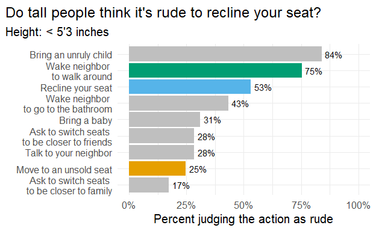

```{r setup, include=FALSE}
knitr::opts_chunk$set(echo = FALSE)

library(flexdashboard)
library(rio)
library(here)
library(tidyverse)

# this has a few columns that I created with the height_script.R script
data <- import(here("data", "flying-etiquette-heights.csv"))


data <- data %>% filter(travel_frequency != "Never")

```


# Draft 1

```{r, layout = "l-body-outset", fig.height= 6, fig.width=10}
figure_3 <- data %>% 
  select(height_inches_numeric, n_get_up, rude_recline, children, rude_baby, rude_child) %>% 
  mutate(rude_recline = recode(rude_recline,
                                          `Yes, very rude` = "Very rude",
                                          `Yes, somewhat rude` = "Somewhat \nrude",
                                          `No, not rude at all` = "Not rude"))

figure_3 %>% 
  filter(height_inches_numeric != "" & rude_recline != "") %>% 
  ggplot(aes(x = rude_recline, y = height_inches_numeric)) +
  geom_boxplot(aes(fill = rude_recline))+
  theme_minimal(base_size = 16)+
  coord_flip()+
  geom_jitter()+
  labs(y = "Height of judger (in inches)",
       x = NULL,
       title = "Is it rude to recline your seat on an airplane?")+
  theme(legend.position = "none",
        plot.title.position = "plot")+
  colorblindr::scale_fill_OkabeIto()
```

In this first draft, I am overlaying points onto boxplots with `geom_jitter()` so that you can see the points that would otherwise be stacked on top of each other. I think the points are distracting here because there are two many points to easily be able to tell distribution patterns. In the next draft I will use a sina plot to plot the distribution of points.


# Draft 2 

```{r, layout = "l-body-outset", fig.height= 6, fig.width=10}
means <- figure_3 %>% 
  group_by(rude_recline) %>% 
  summarize(mean = mean(height_inches_numeric, na.rm = TRUE)) %>% 
  filter(rude_recline != "")

figure_3 %>% 
  filter(height_inches_numeric != "" & rude_recline != "") %>% 
  ggplot(aes(x = rude_recline, y = height_inches_numeric)) +
  theme_minimal(base_size = 16)+
  coord_flip()+
  ggforce::geom_sina(aes(color = rude_recline))+
  labs(y = "Height of judger (in inches)",
       x = NULL,
       title = expression(paste("Is it rude to ", bold("recline your seat"), 
                                   " on an airplane?"))) +
  geom_segment(aes(x = .8, xend= 1.2, y=means[[1,2]], yend=means[[1,2]]), size =1 ) +
  geom_segment(aes(x = 1.8, xend= 2.2, y=means[[2,2]], yend=means[[2,2]]), size = 1) +
  geom_segment(aes(x = 2.8, xend= 3.2, y=means[[3,2]], yend=means[[3,2]]), size = 1) +
  geom_point(data = means, aes(y = mean, x = rude_recline), size = 4) +
  geom_label(label = round(means[[1,2]], 2), x = 1.4, y = means[[1,2]], size = 7) +
  geom_label(label = round(means[[2,2]], 2), x = 2.4, y = means[[2,2]], size = 7) +
  geom_label(label = round(means[[3,2]], 2), x = 3.4, y = means[[3,2]], size = 7) +
  theme(legend.position = "none",
        plot.title.position = "plot")+
  colorblindr::scale_color_OkabeIto()
```

In this draft, I am using a sina plot from the `geom_force()` package in order to see the distribution of the points. I got rid of the box plot because I felt like it distracting. I do want to be able to easily discern the mean easily from the graph, so I also added a point for each mean and a label. For my next draft, I wanted to be able to see all of the judgments (not just reclining behavior), so I used a bar chart and highlighted the judgments that I thought would be related to height.

# Draft 3


```{r}
figure_3b <- data %>% 
  select(starts_with("rude"), height_cat) %>% 
  pivot_longer(cols = starts_with("rude"), 
               values_to = "judgment", 
               names_prefix = "rude_", 
               names_to = "type") %>%
  mutate(judgment = recode(judgment, "No, not rude at all" = "no",
         "Yes, somewhat rude" = "yes",
         "Yes, very rude" = "yes")) %>% 
  filter(judgment == "yes" | judgment == "no") %>% 
  group_by(judgment, height_cat) %>% 
  count(type) %>% 
  pivot_wider(names_from = judgment,
              values_from = n) %>% 
  mutate(total = no + yes,
         perc_no = no/total,
         perc_yes = yes/total) %>% 
  pivot_longer(cols = starts_with("perc"),
               values_to = "perc",
               names_prefix = "perc_",
               names_to = "judgment") %>% 
  select(-c(no, yes)) %>% 
  filter(judgment == "yes")

figure_3b <- figure_3b %>% 
  mutate(type = recode(type, child = "Bring an unruly child",
                wake_walk = "Wake neighbor \nto walk around",
                recline = "Recline your seat",
                wake_bathroom = "Wake neighbor \nto go to the bathroom",
                baby = "Bring a baby",
                switch_friends = "Ask to switch seats \nto be closer to friends",
                talk = "Talk to your neighbor",
                unsold = "Move to an unsold seat",
                switch_family = "Ask to switch seats \nto be closer to family"),
         type_cat = c(NA, NA, "recline", NA, NA, NA, "move", NA, "walk")) %>% 
  filter(height_cat != "")

figure_3b$height_cat <- factor(figure_3b$height_cat, 
                          levels = c("< 5'3", 
                                     "5'3 to 5'6",
                                     "5'7 to 5'10",
                                     "5'11 to 6'2",
                                     "> 6'2"))

```


```{r, echo = TRUE, layout = "l-body-outset", fig.height= 11, fig.width=11,  preview=TRUE}
figure_3b %>% 
  ggplot(aes(x = perc, y = fct_reorder(type, perc))) +
  geom_col(fill = "gray75", alpha = .8)+
  geom_col(aes(fill = type_cat), alpha = .8) +
  labs(x = "Percent judging the action as rude",
       y = NULL,
       title = "Do tall people think it's rude to recline your seat?")+
  theme_minimal(base_size = 18)+
  scale_x_continuous(labels = scales::percent,
                     limits = c(0,1))+
  colorblindr::scale_fill_OkabeIto()+ 
  theme(legend.position = "none",
        plot.title.position = "plot")+
  geom_text(x = figure_3b$perc, y = figure_3b$type, 
            label = paste0(round(figure_3b$perc*100), "%"),
            hjust = -.2)+
  facet_wrap(~height_cat)


```


In this draft, I added all of the judgments so that you can see if tall people differed on other judgments that might be relevant (e.g., tall people might need to wake their neighbor more often to walk around because they are more uncomfortable in their seats). I highlighted  judgments that I thought were relevant so that the viewer focuses in on them. In my last plot, I animated it with `gganimate` so that you can see the same information without having to look at several different graphs.

# Final draft


```{r, echo = TRUE}
a <- figure_3b %>% mutate(type_cat = c("other", "other", "recline", "other", "other", "other", "move", "other", "walk")) %>% 
  ggplot(aes(x = perc, y = fct_reorder(type, perc))) +
  geom_col(aes(fill = type_cat))+
  labs(x = "Percent judging the action as rude",
       y = NULL,
       title = "Do tall people think it's rude to recline your seat?")+
  theme_minimal(base_size = 15)+
  scale_x_continuous(labels = scales::percent,
                     limits = c(0,1))+
  scale_fill_manual(values = c("#E69F00", "gray75", "#56B4E9", "#009E73"))+   
  theme(legend.position = "none",
        plot.title.position = "plot")+
  geom_text(x = figure_3b$perc, y = figure_3b$type, 
            label = paste0(round(figure_3b$perc*100), "%"),
            hjust = -.2)+
  gganimate::transition_states(height_cat, transition_length = 5,
                               state_length = 10) +
  labs(subtitle = 'Height: {closest_state} inches')

```

```{r}
#gganimate::anim_save("datavis_3.gif", a)

```

